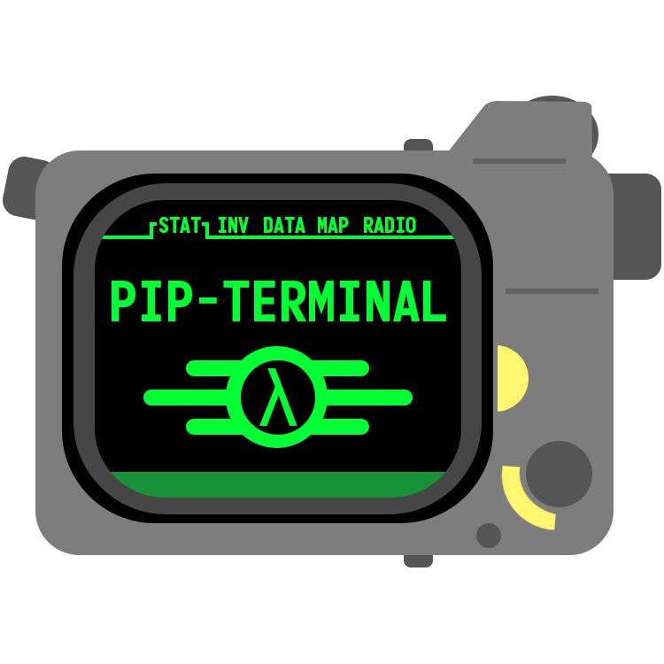

<div align="center">
  
  <h1 align="center">Pip Terminal (<a href="https://www.Pip-Boy.com">Pip-Boy.com</a>)</h1>
  <p align="center">
    A special terminal for giving you a bit more control over your Pip-Boy 3000 Mk V!
  </p>
  <p align="center">
    Purchase the device from the Bethesda store 
    <a href="https://gear.bethesda.net/products/fallout-series-pip-boy-die-cast-replica">
      here</a>. View the official upgrade site 
    <a href="https://www.thewandcompany.com/pip-boy/upgrade/">
      here</a>.
  </p>
</div>

<!---------------------------------------------------------------------------->
<!---------------------------------------------------------------------------->
<!---------------------------------------------------------------------------->

## Index <a name="index"></a>

- [Community](#community)
- [Contribution](#contribution)
  - [Prerequisites](#prerequisites)
  - [Development](#development)
  - [Versioning](#versioning)
  - [Content Guidelines](#content-guidelines)
  - [File Structure](#file-structure)
- [Secrets](#secrets)
  - [Production Secrets](#production-secrets)
  - [Development Secrets](#development-secrets)
- [License(s)](#licenses)
- [Terms of Use](#terms)
- [Wrapping Up](#wrapping-up)

<!---------------------------------------------------------------------------->
<!---------------------------------------------------------------------------->
<!---------------------------------------------------------------------------->

## 💬 Community <a name="community"></a>

Join the Community

- 🎮 Contribute to the [Pip Apps & Games repository][link-pip-apps].
- 🖥️ Join the [Pip-Boy.com Discord][link-discord].
- 🤖 Join the [RobCo Industries Discord][link-discord-robco-industries].
- 🕸️ Visit the [RobCo Industries Website][link-robco-industries].
- 🐛 Report issues [here][link-new-issue].
- 💡 Suggest features in [Discussions][link-github-discussions].

<p align="right">[ <a href="#index">Index</a> ]</p>

<!---------------------------------------------------------------------------->
<!---------------------------------------------------------------------------->
<!---------------------------------------------------------------------------->

## 🛠️ Contribution <a name="contribution"></a>

### Prerequisites <a name="prerequisites"></a>

Node.js: https://nodejs.org/en/download/

<p align="right">[ <a href="#index">Index</a> ]</p>

<!---------------------------------------------------------------------------->
<!---------------------------------------------------------------------------->
<!---------------------------------------------------------------------------->

### Development <a name="development"></a>

To get started with development follow these steps:

1. Fork and clone the repository (`dev` branch).

   ```bash
   git clone -b dev https://github.com/yourname/pip-terminal.git
   cd pip-terminal
   ```

2. Run `git submodule update --init --recursive` to pull all submodules
   recursively.

3. Create a new branch `git checkout -b <your-branch-name>`.

4. Run `npm install` in the root folder to install the project dependencies.

5. Generate a ssl cert:

   ```bash
   mkdir ssl
   cd ssl

   openssl req -x509 -newkey rsa:2048 -nodes -keyout pip-boy.local.key -out pip-boy.local.crt -days 365 -subj "/CN=pip-boy.local"

   cd ..
   ```

6. Update your `hosts` file here: `C:\Windows\System32\drivers\etc\`:

   ```bash
   127.0.0.1 pip-boy.local
   ```

7. Get the latest changes in submodules, run the following:

   ```bash
   git submodule foreach git pull origin main
   ```

8. Be sure to generate the apps for the Pip-Boy mod tool/app loader:

   ```bash
   npm run generate:apps
   ```

9. Run `npm run start:https` to start the development app.

10. You can skip the HTTPS setup if you don't want to test The Wand Company's
    official mod tool/app loader, and run `npm run start` to run on HTTP.

11. Open a browser and navigate to `http://localhost:4200`.

12. Make your changes to the code (browser will automatically reload).

13. Push your changes up to GitHub.

14. Open a pull request to the `dev` branch here.

15. Wait for the pull request to be reviewed and merged.

16. Once in the `dev` branch, your code will go out to production in the next
    release.

Thank you for any and all contributions!

<p align="right">[ <a href="#index">Index</a> ]</p>

<!---------------------------------------------------------------------------->
<!---------------------------------------------------------------------------->
<!---------------------------------------------------------------------------->

### Versioning <a name="versioning"></a>

There is one single source of truth for the project version. This is the
`package.json` file. Steps to update version:

1. Update the "version" property in the `package.json` file.

2. Run `npm run update:version` to manually update the version across the
   project.

> ![Info][img-info] Running `npm run start` or `npm run build` will also update
> the version automatically, and globally from the current `package.json` file.

<p align="right">[ <a href="#index">Index</a> ]</p>

<!---------------------------------------------------------------------------->
<!---------------------------------------------------------------------------->
<!---------------------------------------------------------------------------->

### Content Guidelines <a name="content-guidelines"></a>

When contributing to this project, please ensure that all assets and code are
original, properly licensed, or free to use. We encourage creativity and
experimentation, but ask contributors to respect copyright and legal guidelines.

Avoid including materials that may be subject to copyright or licensing
restrictions, such as:

- Music
- Videos
- Images
- Fonts
- Text
- Source code from other projects

If you're ever unsure whether something is appropriate to include, feel free to
ask in a discussion or open an issue.

<p align="right">[ <a href="#index">Index</a> ]</p>

<!---------------------------------------------------------------------------->
<!---------------------------------------------------------------------------->
<!---------------------------------------------------------------------------->

### File Structure <a name="file-structure"></a>

    .
    ├─ .angular/                   # Angular CLI build cache and temp files (gitignored).
    ├─ .firebase/                  # Firebase data files such as rules.
    ├─ .github/                    # GitHub workflows, actions, and related automation files.
    ├─ .husky/                     # Husky Git hook scripts for enforcing pre-commit rules.
    ├─ .scripts/                   # Project utility and automation scripts.
    ├─ .vscode/                    # VS Code workspace settings, extensions, and tasks.
    ├─ api/                        # Firebase Functions + Express API backend.
    │  ├─ lib/                     # Compiled JavaScript output from the TypeScript API source.
    │  ├─ node_modules/            # API-side Node.js dependencies (gitignored).
    │  ├─ src/                     # API TypeScript source files.
    │  │  ├─ controllers/          # Request handlers for specific API endpoints.
    │  │  ├─ events/               # Firebase event handlers (auth triggers, Firestore hooks, etc.).
    │  │  ├─ models/               # Data models, interfaces, and schema definitions for the API.
    │  │  ├─ seeds/                # Scripts and data for populating Firestore during development.
    │  │  ├─ types/                # TypeScript type definitions shared within the API layer.
    │  │  └─ utilities/            # Reusable helper functions for API logic.
    │  ├─ .prettierignore          # Files/folders to skip during Prettier formatting for API.
    │  ├─ .secret.local            # Local-only secret environment variables for the API (gitignored).
    │  ├─ eslint.config.js         # ESLint configuration for API code style and linting.
    │  ├─ package-lock.json        # Locked dependency versions for the API.
    │  ├─ package.json             # API project metadata and dependency list.
    │  ├─ prettier.config.js       # Prettier configuration for API formatting rules.
    │  ├─ tsconfig.dev.json        # TypeScript config for local development builds of the API.
    │  └─ tsconfig.json            # Base TypeScript configuration for the API.
    ├─ dist/                       # Production build output for the Angular app (auto-generated, gitignored).
    ├─ node_modules/               # Frontend Node.js dependencies (gitignored).
    ├─ public/                     # Static assets served by Firebase Hosting (favicon, icons, etc.).
    ├─ src/                        # Angular UI source code.
    │  ├─ app/                     # Root Angular app folder containing core code.
    │  │  ├─ commands/             # Commands used for the Pip-Boy device I/O.
    │  │  ├─ components/           # Standalone, reusable Angular UI components.
    │  │  ├─ constants/            # Constant values used across the Angular app.
    │  │  ├─ decorators/           # Custom TypeScript/Angular decorators.
    │  │  ├─ directives/           # Attribute and structural directives for DOM behavior.
    │  │  ├─ enums/                # Enum definitions for shared values and states.
    │  │  ├─ guards/               # Route guards for access control and navigation logic.
    │  │  ├─ layout/               # Layout components and templates (header, footer, nav, etc.).
    │  │  ├─ models/               # Frontend data models and interfaces.
    │  │  ├─ pages/                # Routed page components for the application.
    │  │  ├─ pipes/                # Custom Angular pipes for data transformation.
    │  │  ├─ services/             # Injectable services for HTTP, state, storage, etc.
    │  │  ├─ signals/              # Angular signal stores for reactive state.
    │  │  ├─ styles/               # Component-level or global SCSS partials.
    │  │  ├─ types/                # Shared TypeScript type definitions for the UI.
    │  │  ├─ utilities/            # Helper and utility functions for the Angular app.
    │  │  ├─ pip.component.html    # Root UI template for the app.
    │  │  ├─ pip.component.scss    # Styles scoped to the root component.
    │  │  ├─ pip.component.ts      # Root component logic bootstrapped by Angular.
    │  │  └─ pip.config.ts         # Application-wide configuration settings.
    │  ├─ environments/            # Environment-specific Angular config files (dev/prod).
    │  ├─ global.ts                # Global variables, helpers, and type augmentations.
    │  ├─ index.html               # Main HTML shell for the Angular app.
    │  ├─ main.ts                  # Angular bootstrap entry point.
    │  └─ styles.scss              # Global styles for the Angular app.
    ├─ ssl/                        # Local SSL/TLS certificates for HTTPS development (gitignored).
    ├─ .editorconfig               # Shared editor formatting rules.
    ├─ .firebaserc                 # Firebase project alias configuration.
    ├─ .gitignore                  # Git ignore rules.
    ├─ .gitmodules                 # Git submodule definitions.
    ├─ .prettierignore             # Files/folders to skip during Prettier formatting.
    ├─ angular.json                # Angular CLI project configuration.
    ├─ API.md                      # Documentation for API usage and structure.
    ├─ apphosting.yaml             # Firebase App Hosting configuration.
    ├─ eslint.config.js            # ESLint configuration for the root project.
    ├─ firebase.json               # Firebase Hosting and Functions deployment config.
    ├─ LICENSE_MIT.md              # MIT license file for applicable parts of the project.
    ├─ LICENSE_MPL.md              # Mozilla Public License file for applicable parts.
    ├─ LICENSE.md                  # General license details.
    ├─ package-lock.json           # Locked dependency versions for the full project.
    ├─ package.json                # Root project metadata and dependency list.
    ├─ prettier.config.js          # Prettier configuration for the whole project.
    ├─ README.md                   # Main project readme and overview.
    ├─ TERMS.md                    # Project terms of use and conditions.
    ├─ tsconfig.app.json           # Angular app-specific TypeScript configuration.
    ├─ tsconfig.json               # Root TypeScript configuration.
    └─ tsconfig.spec.json          # TypeScript config for Angular test files.

<p align="right">[ <a href="#index">Index</a> ]</p>

<!---------------------------------------------------------------------------->
<!---------------------------------------------------------------------------->
<!---------------------------------------------------------------------------->

## 🤫 Secrets <a name="secrets"></a>

### Production Secrets <a name="production-secrets"></a>

```bash
# Set a secret (value). Enter value when prompted.
firebase functions:secrets:set EXAMPLE_SECRET

# Get secret metadata (version, state, etc.).
firebase functions:secrets:get EXAMPLE_SECRET

# Get the actual secret value.
firebase functions:secrets:access EXAMPLE_SECRET
```

| Secret       | Description                    | Example Value               |
| ------------ | ------------------------------ | --------------------------- |
| ADMIN_EMAILS | List of admin email addresses. | `["support@pip-boy.local"]` |

### Development Secrets <a name="development-secrets"></a>

API secrets for local development are stored as JSON files in:

`api/src/secrets/*.json`

Environment variables are stored in the App Hosting configuration file:

`~apphosting.yaml`

<p align="right">[ <a href="#index">Index</a> ]</p>

<!---------------------------------------------------------------------------->
<!---------------------------------------------------------------------------->
<!---------------------------------------------------------------------------->

## ⚖️ License(s) <a name="licenses"></a>

This project is licensed under the Creative Commons Attribution-NonCommercial
4.0 International License. See the [license][link-license] file for more
information.

This project uses the following third party libraries:

- jszip: A library for creating, reading, and editing .zip files. Licensed under
  the [MIT License][link-license-mit].

- https://github.com/CodyTolene/pip-boy-apps

- https://github.com/espruino/EspruinoAppLoaderCore

- https://github.com/espruino/EspruinoWebTools

This project uses the **Monofonto** font by Typodermic Fonts Inc. for the
project PNG logo.

- Free for desktop and image/logo use (commercial & non-commercial).
- Download from: [Typodermic Fonts][link-font-monofonto]

This project uses sounds found on FreeSound.org. The sounds are licensed under
the Creative Commons 0 License. The list of sounds can be found below:

- [`tick.wav`](https://freesound.org/people/Joao_Janz/sounds/477704/) by
  Joao_Janz

- [`tick-2.wav`](https://freesound.org/people/joedeshon/sounds/119415/) by
  joedeshon

`SPDX-License-Identifiers: CC-BY-NC-4.0, MPL-2.0, LicenseRef-Typodermic-Free-Desktop, CC0-1.0`

> ![Warn][img-warn] By using this software, you acknowledge and agree to the
> terms of these licenses.

<p align="right">[ <a href="#index">Index</a> ]</p>

<!---------------------------------------------------------------------------->
<!---------------------------------------------------------------------------->
<!---------------------------------------------------------------------------->

## 📜 Terms of Use <a name="terms"></a>

Bethesda Softworks, LLC. The Wand Company, all trademarks, logos, and brand
names are the property of their respective owners. This project is for personal
use only and is not intended for commercial purposes. Use of any materials is at
your own risk.

For more information, see the full [Terms of Use][link-terms] document.

<p align="right">[ <a href="#index">Index</a> ]</p>

<!---------------------------------------------------------------------------->
<!---------------------------------------------------------------------------->
<!---------------------------------------------------------------------------->

## 🏁 Wrapping Up <a name="wrapping-up"></a>

Thank you to Bethesda & The Wand Company for such a fun device to tinker with!
If you have any questions, please let me know by opening an issue
[here][link-new-issue].

| Type                                                                      | Info                                                           |
| :------------------------------------------------------------------------ | :------------------------------------------------------------- |
|                 | webmaster@codytolene.com                                       |
|            | https://github.com/sponsors/CodyTolene                         |
|      | https://www.buymeacoffee.com/codytolene                        |
|  | bc1qfx3lvspkj0q077u3gnrnxqkqwyvcku2nml86wmudy7yf2u8edmqq0a5vnt |

Fin. Happy programming friend!

Cody Tolene

<!---------------------------------------------------------------------------->
<!---------------------------------------------------------------------------->
<!---------------------------------------------------------------------------->

<!-- IMAGE REFERENCES -->

[img-info]: .github/images/ng-icons/info.svg
[img-warn]: .github/images/ng-icons/warn.svg

<!-- LINK REFERENCES -->

[link-discord-robco-industries]: https://discord.gg/WNEuWsck6n
[link-discord]: https://discord.gg/zQmAkEg8XG
[link-ffmpeg]: https://ffmpeg.org/
[link-font-monofonto]: https://typodermicfonts.com/monofonto/
[link-github-discussions]:
  https://github.com/CodyTolene/pip-terminal/discussions
[link-license-mit]: /LICENSE_MIT.md
[link-license-mpl]: /LICENSE_MPL.md
[link-license]: /LICENSE.md
[link-new-issue]: https://github.com/CodyTolene/pip-terminal/issues
[link-pip-apps]: https://github.com/CodyTolene/pip-boy-apps
[link-robco-industries]: https://log.robco-industries.org/
[link-terms]: /TERMS.md
