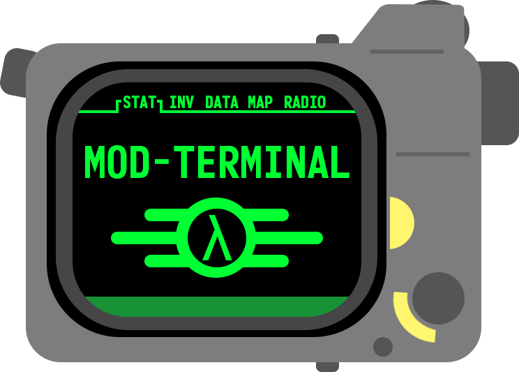

  
  <h1 align="center">Pip-Boy Mod Terminal</h1>
  

    A special terminal for giving you a bit more control over your Pip-Boy 3000 Mk V!
  

  

    Purchase the device from the Bethesda store [here][link-pip-boy]. View the official upgrade site [here][link-upgrade].
  

## Index 

- [Web App](#web-app)
  - [Connecting](#connecting)
  - [Personalizing](#personalizing)
  - [Firmware Upgrade](#firmware-upgrade)
  - [Videos](#videos)
  - [Music](#music)
- [License(s)](#licenses)
- [Terms of Use](#terms-of-use)
- [Wrapping Up](#wrapping-up)

<!---------------------------------------------------------------------------->
<!---------------------------------------------------------------------------->
<!---------------------------------------------------------------------------->

## Web App 

https://raw.githack.com/CodyTolene/pip-boy-mod-terminal/main/index.html

### Connecting

...

### Personalizing

...

### Firmware Upgrade

...

### Videos

...

### Music

...

## License(s)

This project is licensed under the MIT License. See the [LICENSE_MIT][link-license-mit] file for more information.

`SPDX-License-Identifier: MIT`

One file, "scripts/uart.js" is licensed under the Mozilla Public License 2.0. See the [LICENSE_MPL][link-license-mpl] file for more information.

`SPDX-License-Identifier: MPL-2.0`

This project uses the **Monofonto** font by Typodermic Fonts Inc. for the project PNG logo.

- Free for desktop and image/logo use (commercial & non-commercial).
- Download from: [Typodermic Fonts][link-font-monofonto]

`SPDX-License-Identifier: LicenseRef-Typodermic-Free-Desktop`

By using this software, you acknowledge and agree to the terms of these licenses.

## Terms of Use

Bethesda Softworks, LLC. All trademarks, logos, and brand names are the property of their respective owners. This project is for personal use only and is not intended for commercial purposes. Use of any materials is at your own risk.

For more information, see the full [Terms of Use][link-terms] document.

## Wrapping Up 

Thank you to Bethesda & The Wand Company for such a fun device to tinker with, I'm having a lot of fun with this project as embedded systems are a passion of mine. If you have any questions, please let me know by opening an issue [here][url-new-issue].

| Type                                                                      | Info                                                           |
| :------------------------------------------------------------------------ | :------------------------------------------------------------- |
|                 | webmaster@codytolene.com                                       |
|            | https://github.com/sponsors/CodyTolene                         |
|      | https://www.buymeacoffee.com/codytolene                        |
|  | bc1qfx3lvspkj0q077u3gnrnxqkqwyvcku2nml86wmudy7yf2u8edmqq0a5vnt |

Fin. Happy programming friend!

Cody Tolene

<!---------------------------------------------------------------------------->
<!---------------------------------------------------------------------------->
<!---------------------------------------------------------------------------->

<!-- IMAGE REFERENCES -->

[img-info]: .github/images/ng-icons/info.svg
[img-warning]: .github/images/ng-icons/warn.svg

<!-- LINK REFERENCES -->

[link-font-monofonto]: https://typodermicfonts.com/monofonto/
[link-license-mit]: /LICENSE_MIT.md
[link-license-mpl]: /LICENSE_MPL.md
[link-pip-boy]: https://gear.bethesda.net/products/fallout-series-pip-boy-die-cast-replica
[link-terms]: /TERMS.md
[link-upgrade]: https://www.thewandcompany.com/pip-boy/upgrade/
[url-new-issue]: https://github.com/CodyTolene/pip-boy-mod-terminal/issues
